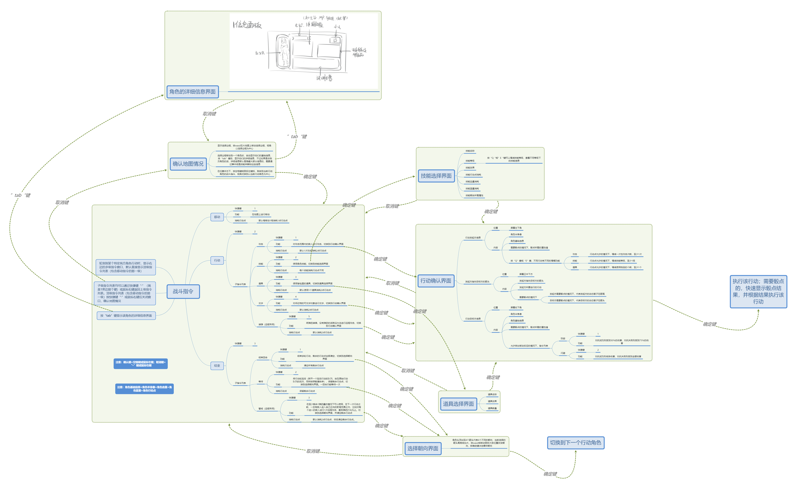

# 基于插图98和战斗指令的程序框架

## 程序框架化分解

### UI层：提供指令列表，获取指令
- 角色信息界面
  -  立绘：可动？
  -  属性值：HP，MP，行动点
  -  技能和物品：图文
  -  说明：文本
- 道具选择界面
  - 道具槽
  - 道具本体
  - 道具说明框
- 行动确定界面（行动弹窗）
  - 人像框
  - 属性说明栏
  - 行动演示（骰子出现位置，箭头方向，）
- 视觉效果
    -  鼠标停留或键盘选中或快捷键选中表现设置
    -  指令列表的展开模式可选
    -  指令的演示动画
- 朝向选择界面（俯瞰人物，四个方向）

### 实例表现层：接收规则层的指令，返回实例实时参数
-  地图系统   
   -  大地图：鸟瞰地图全体，并且用小框控制视角
-  维护玩家的游玩信息
   -   触发显示在屏幕中的其他角色的信息：避免高开销坐标换算，直接利用空间坐标
- 内存池
  - 棋盘实例
  - 物件预渲染

### 游戏周期层：限制玩家行为，提供操作接口
- 根据角色属性值，提供合法的角色行动选项
  公共骰子
- 控制音乐和效果音的状态
- 指令树
    -  可维护的行动类型与接口函数槽
    -  每个行动的属性值可调
    -  指令间的层次关系
- 指令监听
    -  快捷键设置
    -  键盘操控设置
    -  鼠标操控设置 

### 系统层
- 游戏的存档管理
- 游戏的开始画面
- 游戏的音量或其他的自定义设置

